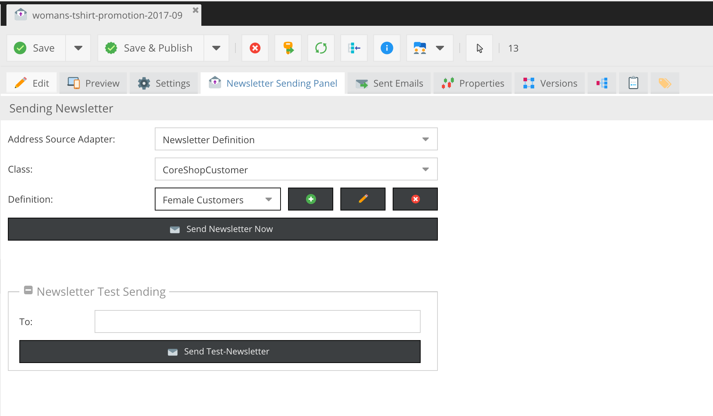

# Pimcore - Newsletter Definition

This Bundle enhances Pimcore with re-usable, easy-to-create Definitions for Newsletter Filters

### Requirements
 * Pimcore 5

### Installation
1. Add code below to your `composer.json`
2. Activate & install it through the ExtensionManager

```json
"require" : {
    "w-vision/newsletter-definition" : "1.0.0",
}
```

### Configuration
There is nothing to configure. Simply add enable and install it, create a newsletter and choose "Newsletter Definition" from the Adapter Source List

## Screenshots


